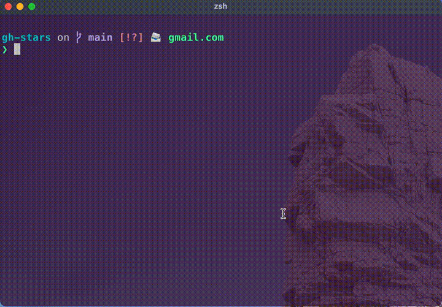

# gh-stars
Displays an interactive your github stars.



## usage
```
❯ gh stars -h
Displays an interactive your stars. The selected star is print url.
Dependencies: fzf

Usage
  gh stars [NUMBER]

NUMBER: Number of stars to display (default: 30)
```

If you want to change the number of stars to get, put a number in the first argument. (default: 30)

## install
required fzf command.

```
gh extension install korosuke613/gh-stars
```


