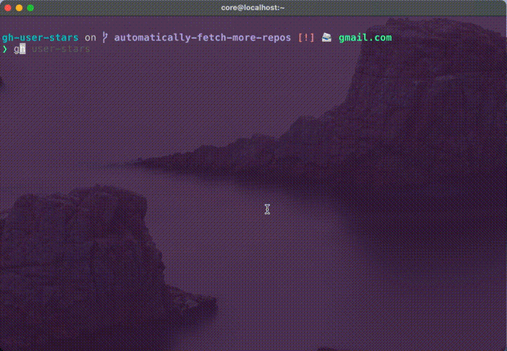

# gh-user-stars
Displays an interactive your github stars.



## usage
```
❯ gh user-stars -h

Displays an interactive your stars. The selected star is print url.
Dependencies: fzf, jq

Usage
  gh user-stars [NUMBER]

NUMBER: Number of stars to fetch at a time. (default: 50, max: 100)
```

If you want to change the number of stars to fetch at a time, put a number in the first argument. (default: 50)

## install
Required the following commands.
- [fzf](https://github.com/junegunn/fzf)
- [jq](https://github.com/stedolan/jq)

```
gh extension install korosuke613/gh-user-stars
```


